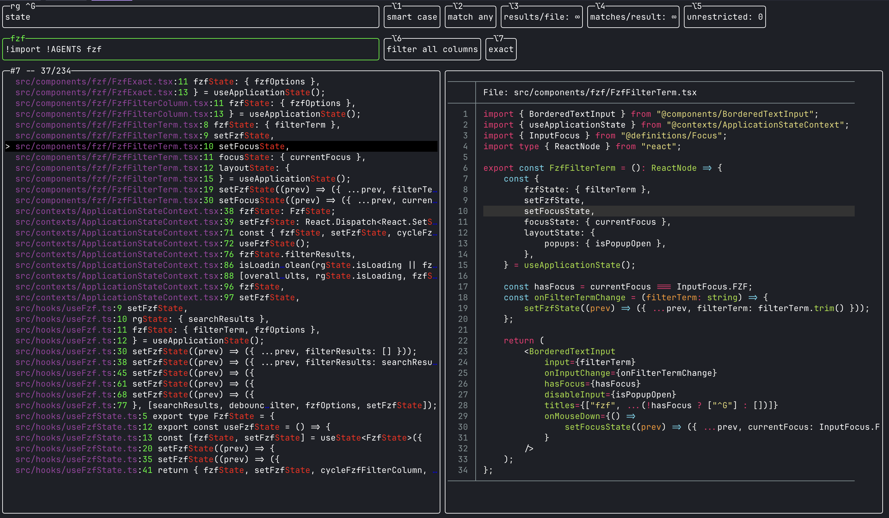

# kondor

> [!NOTE]
> Heavily inspired by:
>
> - https://junegunn.github.io/fzf/tips/ripgrep-integration/

<br/>

A terminal-based interactive full-text search tool.

<br/>



## Summary

- Combines ripgrep's search power with fzf's easy-to-use [filter syntax](https://github.com/junegunn/fzf?tab=readme-ov-file#search-syntax).
- Add a simple search term and refine the results via word by word filtering in fzf - goodbye regex editing sessions.
- Prefix a filter term with `!` to exclude matching results.
- By default, fzf filters across file paths and line content simultaneously. Constrain to either with the filter column toggle.
- rg and fzf both use smart casing on default: Lowercase matches ignore case; uppercase forces case sensitivity.
- Different rg and fzf options simplify your current search task.

## Usage

```sh
kondor [search-term]
```

## Platforms

Kondor supports **macOS** (ARM64) and **Linux** (x64 & ARM64).

## Installation

### Brew (macOS)

```sh
brew tap andenkondor/zapfhahn
brew install andenkondor/zapfhahn/kondor
```

### Build from source

Requires [Bun](https://bun.sh) and the following tools on your `PATH`:
[ripgrep](https://github.com/BurntSushi/ripgrep), [fzf](https://github.com/junegunn/fzf) and [bat](https://github.com/sharkdp/bat).

```sh
bun install
bun run build
./dist/index.js
```

## rg Options

These control how `ripgrep` scans the filesystem. Toggled from a toolbar row (keyboard or mouse):

| Key     | Option                 | Description                                            |
| ------- | ---------------------- | ------------------------------------------------------ |
| `Opt-1` | **Case Sensitivity**   | Toggle `--smart-case` / `--case-sensitive`             |
| `Opt-2` | **Word Regexp**        | Toggle `--word-regexp` (whole word matching)           |
| `Opt-3` | **Results Per File**   | Toggle `--max-count` (max. 1 result/file vs. no limit) |
| `Opt-4` | **Matches Per Result** | Toggle single match vs. all matches per result line    |
| `Opt-5` | **Unrestricted**       | Cycle unrestricted level (`-u`, `-uu`)                 |

## fzf Options

These control how `fzf` filters the rg results. Toggled from a second toolbar row (keyboard or mouse):

| Key     | Option            | Description                                      |
| ------- | ----------------- | ------------------------------------------------ |
| `Opt-6` | **Filter Column** | Cycle through "all" / "filePath" / "lineContent" |
| `Opt-7` | **Exact Match**   | Toggle exact vs. fuzzy matching                  |

## Remaining Shortcuts

### Navigation

| Key                   | Action                    |
| --------------------- | ------------------------- |
| `Up` / `Down`         | Move selection            |
| `PageUp` / `PageDown` | Move selection by 5 lines |
| `Home`                | Jump to first result      |
| `End`                 | Jump to last result       |

### Actions

| Key           | Action                                                                   |
| ------------- | ------------------------------------------------------------------------ |
| `Enter`       | Open result(s) in $EDITOR (nvim/vim will open multiple in quickfix list) |
| `Shift+Enter` | Show "Open with" popup to pick a custom opener                           |
| `Tab`         | Toggle mark on the selected result                                       |
| `Ctrl-=`      | Cycle preview layout (right / bottom)                                    |
| `Ctrl-a`      | Toggle select all / deselect all marks                                   |
| `Ctrl-g`      | Toggle input focus between Rg search term and Fzf filter term            |
| `Ctrl-p`      | Toggle preview pane on/off                                               |
| `Ctrl-r`      | Refresh / re-run the current rg search                                   |
| `Ctrl-x`      | Delete (ignore) the selected result from the list                        |

## Configuration

Settings are stored in `~/.config/kondor/kondor-settings.yaml`. All fields are optional.

### Example

```yaml
preview:
  # Show preview on startup. (boolean). Default: false
  showOnStart: false
  # Preview position. ("right" | "bottom"). Default: right
  layout: right

# Shift+Enter popup entries. Default: []
openers:
  # Label shown in the popup.
  - description: "vim"
    # Shell command with {{.SelectedFile.*}} placeholders.
    command: 'vim {{.SelectedFile.Name}} -c "call cursor({{.SelectedFile.LineNumber}}, {{.SelectedFile.ColumnNumber}}"'
    # Takes over terminal. (boolean, optional)
    terminal: true
  - description: "Zed"
    command: "zed . {{.SelectedFile.Name}}:{{.SelectedFile.LineNumber}}:{{.SelectedFile.ColumnNumber}}"
  - description: "Yazi"
    command: "yazi {{.SelectedFile.Name}}"
    terminal: true

# A color is either an ANSI palette index (0-255, adapts to terminal theme)
# or a hex string (`#RRGGBB` or `#RRGGBBAA`).
colors:
  # ── General ──────────────────────────────────
  # Non-highlighted text. Omit to use terminal default. Default: 7 (ANSI white)
  defaultText: 7

  # ── Result list ──────────────────────────────────
  # File path text. Default: 5 (ANSI magenta)
  filePathText: 5
  # Match highlight. Default: 9 (ANSI bright red)
  highlightedText: 9
  # Line number. Default: 6 (ANSI cyan)
  fileLineNumberText: 6
  # Truncation ellipsis. Default: 4 (ANSI blue)
  truncationText: 4
  # Selected row background. Default: 8 (ANSI bright black)
  selectedBackground: 8

  # ── Borders ──────────────────────────────────────
  # Focused element (input, popup) border. Default: 2 (ANSI green)
  focusedBorder: 2
  # Unfocused input border. Default: 7 (ANSI white)
  unfocusedBorder: 7
  # Toggled widget border. Default: 3 (ANSI yellow)
  highlightedBorder: 3
  # Error footer border. Default: 1 (ANSI red)
  errorBorder: 1

  # ── Popup ────────────────────────────────────────
  # Popup content background. Default: 0 (ANSI black)
  popupBackground: 0
  # Backdrop overlay. Hex with alpha (ANSI indices don't support alpha). Default: "#00000080"
  popupOverlay: "#00000080"

# Marked result indicator. Default: "○"
markSymbol: "○"
# Selected result indicator. Default: ">"
selectionSymbol: ">"
# Border style. ("single" | "double" | "rounded" | "heavy"). Default: rounded
borderType: rounded
```

### Openers

Placeholders for openers:

| Placeholder                      | Description               |
| -------------------------------- | ------------------------- |
| `{{.SelectedFile.Name}}`         | File path (shell-escaped) |
| `{{.SelectedFile.LineNumber}}`   | Line number               |
| `{{.SelectedFile.ColumnNumber}}` | Column number             |
